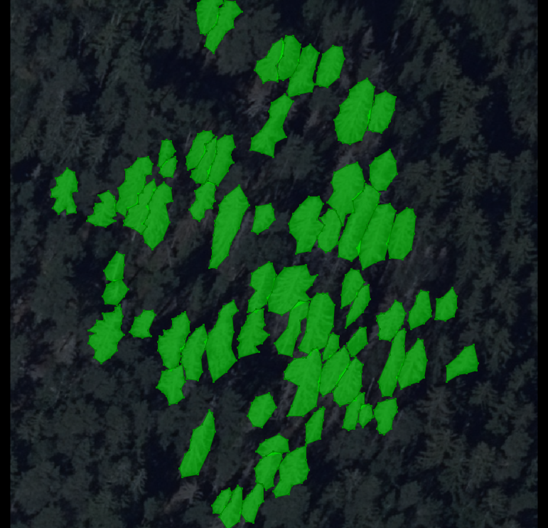
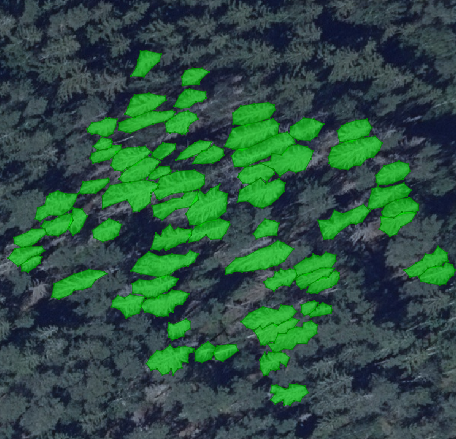
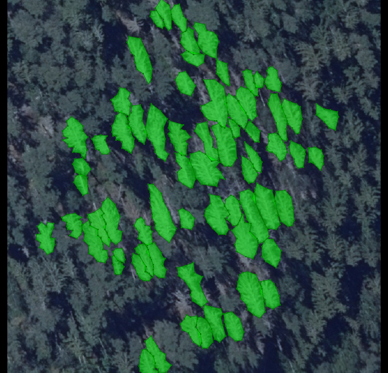

# IMAGE AUGMENTER WITH POLYGON MASKS

Create augmented images, masks and annotations file for image augmentation.

Reads a VGG Image Annotator file (json) and outputs desired augmentations, masks and annotation file.

## Example

###Input
Create annotations for any images with [VIA annotator tool](https://www.robots.ox.ac.uk/~vgg/software/via/)

###Settings
* adjust settings.ini file

```
[paths]
ANNOTATIONS_FILE = data/input/main_elov_train_json.json
IMAGE_PATH = data/input/
OUTPUT_DIR = data/output/
```

* Select augmenters [imgaug](https://imgaug.readthedocs.io/en/latest/source/overview_of_augmenters.html) and adjust class varibales.
```python
AUGMENTERS = [
    iaa.Fliplr(0, name='Original'),  # Keeps original image
    iaa.Rot90(1, keep_size=False, name='rot_90'),  # Rotate by 90 degrees
    iaa.Rot90(2, keep_size=False, name='rot_180'),  # Rotate by 180 degrees
    iaa.Rot90(3, keep_size=False, name='rot_270'),  # Rotate by 270 degrees

    # Mirror, rotate by 90 degrees and darken image
    iaa.Sequential(
        [iaa.Fliplr(1),
         iaa.Rot90(1, keep_size=False),
         iaa.Multiply(0.5)], name='lr_rot_90_dark'),
    # Mirror, rotate by 180 degrees and brighten image
    iaa.Sequential(
        [iaa.Fliplr(1),
         iaa.Rot90(2, keep_size=False),
         iaa.Multiply(1.5)], name='lr_rot_180_bright'),
    # Mirror, rotate by 270 degrees and randomly darken/brighten image
    iaa.Sequential(
        [iaa.Fliplr(1),
         iaa.Rot90(3, keep_size=False),
         iaa.Multiply((0.5, 1.5))], name='lr_rot_270_random'),
]
```

* run script

## Output

Runs all augmenters and creates annotations file with all augmented images.
Select **validate=False** to get masks drawn on images.




